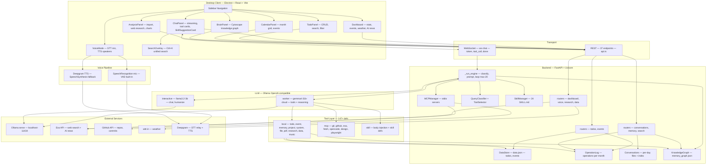

# Mayday — Full Architecture

```mermaid
flowchart TB
    subgraph Client["Desktop Client — Electron + React + Vite"]
        UI["Sidebar Navigation"]
        DASH["Dashboard — stats, events, weather, AI news"]
        CHAT["ChatPanel — streaming, tool cards, SkillSuggestionCard"]
        TODO["TodoPanel — CRUD, search, filter"]
        CAL["CalendarPanel — month grid, events"]
        BRAIN["BrainPanel — Cytoscape knowledge graph"]
        VOICE["VoiceMode — STT mic, TTS speakers"]
        DATA["AnalysisPanel — import, web research, charts"]
        SEARCH["SearchOverlay — Ctrl+K unified search"]
    end

    subgraph Transport["Transport"]
        REST["REST — 37 endpoints — api.ts"]
        WS["WebSocket — ws-chat — token, tool_call, done"]
    end

    subgraph Backend["Backend — FastAPI + Uvicorn"]
        R_TODO["routers — todos, events"]
        R_MEM["routers — conversations, memory, search"]
        R_DASH["routers — dashboard, voice, research, data"]
        ENGINE["_run_engine — classify, prompt, loop max-20"]
        SELECTOR["QueryClassifier + ToolSelector"]
        STORE["DataStore — data.json — todos, events"]
        OPS["OperationLog — operations per-month"]
        CONV["Conversations — per-day files + index"]
        GRAPH["KnowledgeGraph — memory_graph.json"]
        SKILLS["SkillManager — 24 SKILL.md"]
        MCP["MCPManager — stdio servers"]
    end

    subgraph LLM["LLM — Ollama OpenAI-compatible"]
        WORKER["worker — gemma4-31b-cloud — tools + reasoning"]
        LOCAL["interactive — llama3.2-3b — chat, humanize"]
    end

    subgraph Tools["Tool Layer — 147+ defs"]
        LT["local — todo, event, memory, project, system, file, pdf, research, data, music"]
        MT["mcp — git, github, exa, fetch, opencode, design, playwright"]
        ST["skill — body injection + skill defs"]
    end

    subgraph Voice["Voice Pipeline"]
        STT["SpeechRecognition mic — VAD built-in"]
        TTS["Deepgram TTS — SpeechSynthesis fallback"]
    end

    subgraph External["External Services"]
        OLLAMA["Ollama serve — localhost-11434"]
        EXA["Exa API — web search + AI news"]
        GH["GitHub API — repos, commits"]
        WTTR["wttr.in — weather"]
        DG["Deepgram — STT relay + TTS"]
    end

    UI --> DASH & CHAT & TODO & CAL & BRAIN & VOICE & DATA
    CHAT --> SEARCH
    DASH & CHAT & TODO & CAL & BRAIN & DATA --> REST
    CHAT <--> WS
    VOICE --> STT & TTS
    REST --> R_TODO & R_MEM & R_DASH
    WS --> ENGINE
    ENGINE --> SELECTOR & SKILLS & MCP & GRAPH
    ENGINE <--> WORKER
    ENGINE --> LOCAL
    WORKER --> LT & MT & ST
    R_TODO --> STORE & OPS
    R_MEM --> CONV & GRAPH & OPS
    LT --> STORE & GRAPH & OPS
    MCP --> GH & EXA
    R_DASH --> EXA & WTTR
    STT --> DG
    TTS --> DG
    WORKER & LOCAL --> OLLAMA
```
